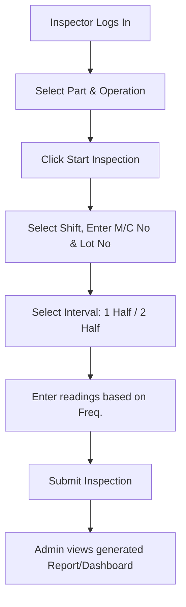

# IRMS - User Manual & Process Guide

Welcome to the **Inspection Report Management System (IRMS)**. This system digitizes the shop floor paper check sheets, enabling real-time validation of inspection readings, automated pass/fail verification, and instant report generation.

---

## 1. System Overview & Shift Schedule

The manufacturing plant runs **24 hours a day**, divided into **three 8-hour shifts**:
* **Shift A:** 06:00 to 14:00 (1st Shift)
* **Shift B:** 14:00 to 22:00 (2nd Shift)
* **Shift C:** 22:00 to 06:00 (3rd Shift)
* *(Optional) Shift D:* 09:00 to 17:00 (General Shift)

For each active shift, inspections are performed in intervals:
* **1 Half** (First 4 hours of the shift)
* **2 Half** (Second 4 hours of the shift)
* **First Piece** (Setup verification)
* **Last Piece** (Run-out verification)

---

## 2. Configuration: Master Data Excel Upload

Before inspectors can enter readings, the administrator must upload the check sheet configuration:

1. Log in as **Administrator** (`admin` / `admin123`).
2. Click **Excel Upload** in the left sidebar.
3. (Optional) Click **Download Template** to download the standard format.
4. Drag and drop your completed check sheet Excel file (`.xlsx` or `.xls`) into the upload zone.
5. The system parses the spreadsheet and displays a **Preview** of all rows.
6. Verify that the parameter count and descriptions are correct:
   * **Visual checks** (attributes without numeric tolerances) should have `"ok"`, `"ng"`, or blank cells in the control limit columns.
   * **Numeric checks** should have numeric values in the MIN/MAX limit columns.
7. Click **Confirm & Import** to save.

Once imported, the parts, operations, and inspection parameters are populated under the **Master Data** page.

---

## 3. End-to-End Inspection Entry Flow

To log readings, inspectors perform the following steps:

### Step 3.1: Start the Entry
1. Log in as **Inspector** (`inspector` / `inspector123`).
2. On the home page, select the **Part Number** (e.g., `OP1010`) and **Operation** (e.g., `1010` / `OP1020`).
3. Click **Start Inspection**.

### Step 3.2: General Header Information
In the top form section, enter:
* **Shift:** Select your current shift (e.g., `Shift A`).
* **M/C No:** The machine identifier (e.g., `CNC-01`).
* **Interval:** Select `1 Half` or `2 Half`.
* **Lot Number:** The production batch number (e.g., `L-1234`).

### Step 3.3: Enter Readings (Dynamic Box Generation)
The table automatically generates the correct number of input boxes for each parameter based on its **Frequency of Inspection**:

| Frequency on Check Sheet | Interval Selection | Generated Input Boxes | Description |
| :--- | :--- | :---: | :--- |
| **4nos/shift** | `1 Half` | **2** | Enter 2 readings during the first half. |
| **4nos/shift** | `2 Half` | **2** | Enter 2 readings during the second half. |
| **2nos/shift** | `1 Half` | **1** | Enter 1 reading during the first half. |
| **2nos/shift** | `2 Half` | **1** | Enter 1 reading during the second half. |
| **1no/shift** / **1no/Day** | `1 Half` or `2 Half` | **1** | Enter 1 reading during the selected half. |

#### Entering Reading Values:
1. **Numeric Parameters:** Enter the observed decimal value (e.g. `39.310`).
   * The system checks if it falls within the MIN/MAX limits.
   * If it is within range, it lights up **PASS** (Green).
   * If it is outside range, it lights up **FAIL** (Red).
2. **Visual Checks:** Enter **`ok`** / **`pass`** (Green PASS) or **`ng`** / **`fail`** (Red FAIL).

> [!IMPORTANT]
> If **any single reading** fails or is flagged as `ng`, the bottom sticky bar will display **`REJECTED LOT`** and lock the transaction as rejected to ensure quality control.

### Step 3.4: Submit and Save
1. Ensure all generated reading boxes for the selected interval are filled.
2. Enter any comments in the **Remarks** section.
3. Click **Submit Inspection**.

---

## 4. Reports & Dashboards

* **Real-time Dashboard:** Displays total inspections, passed lots, rejected lots, and pending counts. It also provides a **Shift Summary** breakdown to track performance.
* **Reports Archive:** In the sidebar, click **Reports** to view all saved checksheet transactions. You can click the **Eye icon** next to any record to view its detail page, inspect the specific values, or print it out as a certified inspection report.
